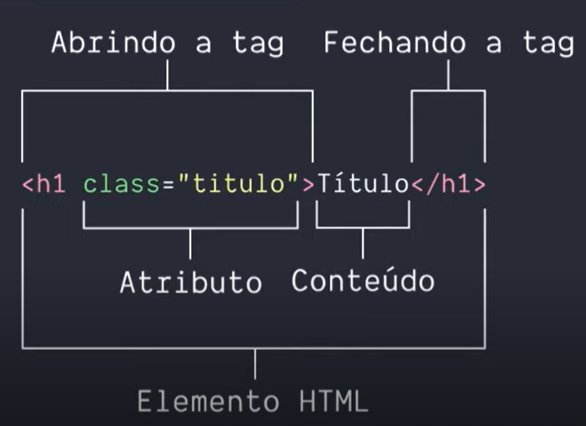

# Conceitos básicos de HTML

### Elemento HTML    



### Estrutura básica 

```
<!DOCTYPE html>
<html>
    <head>
        <meta>
        <title></title>
    </head>
    <body>
    </body>
</html>
```


